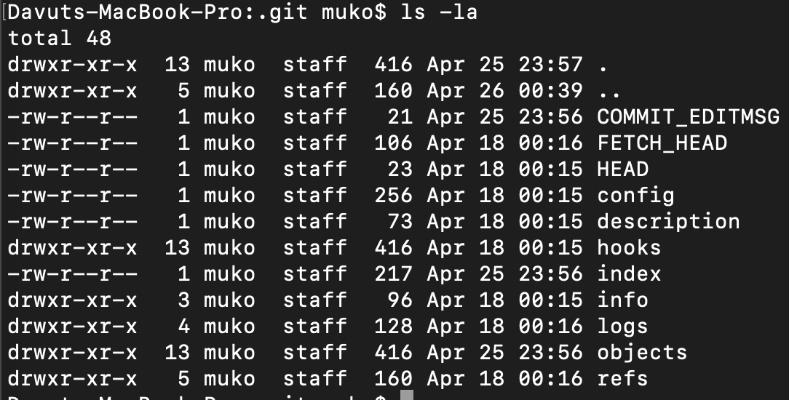

#  Common Commands Cheatsheet
## Git Commands
1. mkdir <my_directory>

    // Create a new directory // Yeni bir klasör oluştur

2. cd <my_directory> 

    // Go to the directory // Oluşturduğun klasörün içine git

3. git init

    //  Create a ".git" directory (not a file) which turns your directory into a git repository. 
   
    // ".git" klasörü oluşturarak kendi klasörünü git deposuna dönüştür. (Bu sayede klasöründekileri uzak depoya gönderip her farklı versiyonuyla kaydedebilirsin.)
   
    // ".git" directory consists of commit logs and configuration info etc. 
 
    // ".git" klasörü kısaca, kaydettiğin farklı versiyonların bilgisini ve senin github repolarına ait bilgileri vb. tutar diyebiliriz.

4. ls -la
 
    // Show not only visible but also hidden contents of the current directory Check whether the ".git" directory exists.
    
    // Klasörün git deposuna dönüşmesi için oluşması gereken gizli ".git" klasörünün oluşup oluşmadığını kontrol et
    
    
    
5. Open your repositories from browser <https://github.com/user_name?tab=repositories> 

    // Tarayıcıdan "Repositories" kısmına gel.

6. Create "New" repository. 

    // "New" ile yeni bir uzak kod deposu oluştur. 

    
    
7. git remote add origin <https://github.com/user_name/repo_name.git> 

// Github remote repository is identified with your directory. 

// Github uzak depo ile lokaldeki klasörünü ilişkilendir. 

// Bla bla bla

## Useful Commands

* mkdir <folder_name>

// Create a folder

// Klasör oluştur

* cd <directory/directory/another_directory/>

// Go to a path

// Yolu verilen bir klasörün içine git

* 

:angry:

 

